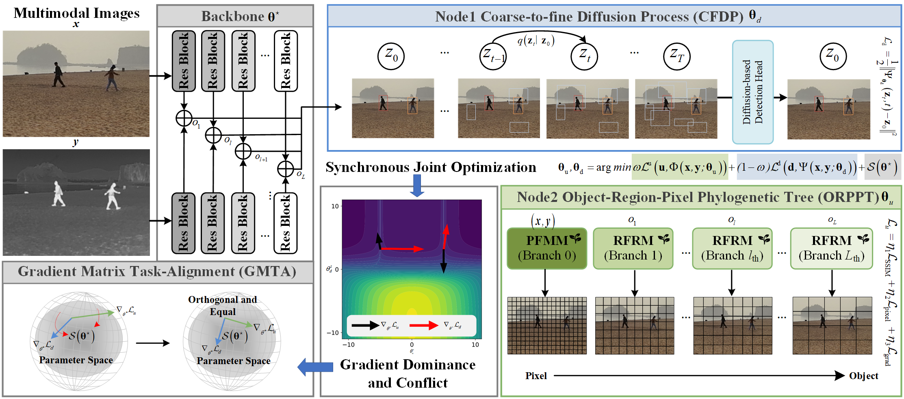

<div align="center">
<h1> E2E-MFD </h1>
<h3> E2E-MFD: Towards End-to-End Synchronous Multimodal Fusion Detection</h3>

</div>

## The oriented OD code is released at https://github.com/icey-zhang/E2E-MFD.


## **Overview**

<p align="center">
  
</p>

## **Getting Started**

### Create the environment

**Step 1: Clone the E2E-MFD repository:**

To get started, first clone the E2E-MFD repository and navigate to the project directory:

```bash
git clone *****
cd *****
```

**Step 2: Environment Setup:**

E2E-MFD recommends setting up a conda environment and installing dependencies via pip. Use the following commands to set up your environment:

***Create and activate a new conda environment***

```bash
conda create -n E2E-MFD python=3.9.16
conda activate E2E-MFD
```

### Prepare the dataset M3FD

you can download the dataset and then run 
```bash
python tools/get_data.py
python txt2xml.py
```

Training data and test data are divided in the [path](./datasets/M3FD/ImageSets/Main)

```python
EfficientMFD
├── datasets
│   ├── M3FD
│   │   ├── ImageSets
│   │   │   ├── trainval.txt
│   │   │   ├── test.txt
│   │   ├── Annotations
│   │   │   ├── 00000.xml
│   │   │   ├── 00001.xml
│   │   │   ├── ......
│   │   ├── JPEGImages
│   │   │   ├── 00000.mat
│   │   │   ├── 00001.mat
│   │   │   ├── ......
```


### Begin to train and test

Use the config file with [this](./configs/diffdet.coco.res50.yaml).

```python
python ./train_net.py
python ./test.py
```

### Generate fusion images

```python
python ./save_test_fusion_V.py
```

## **Result**

[M3FD weights]() <br>
[M3FD logs](./assets/train.log)


If you have any questions, please contact mingxiangcao@stu.xidian.edu.cn.

